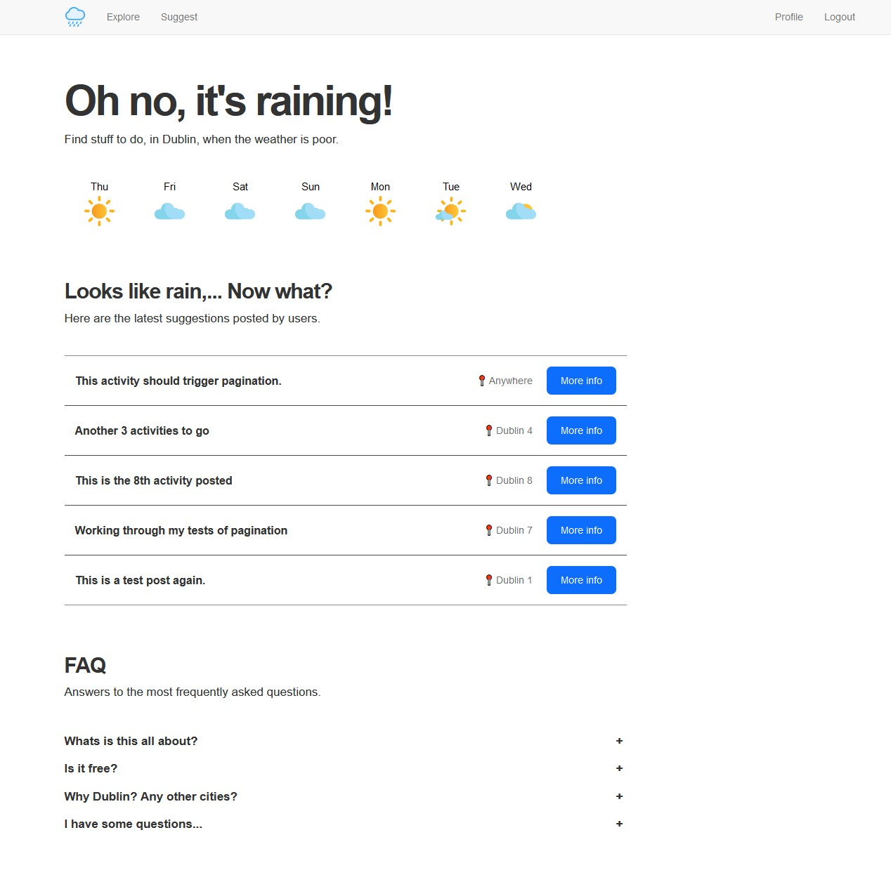

# About 
This is a project triggered from the completion of the Flask Mega Tutorial by Miguel Grinberg. 

The project is simple: a web-app that users can use to get inspiration on what to do on a rainy day, in Dublin. Users can also suggest activities. 

The aim of the project is for me to test my new-learnt Flask skills. 

The project is live here: [toie.pythonanywhere.com/](https://toie.pythonanywhere.com/)

# Features
- Authentication
    - User registration 
    - User password reset 
    - User login
    - User logout
- Public
    - 7-day weather forecast
    - Display of the 5-latest activities posted
- Members
    - Lists of activities
    - Filter through activities, by location
    - Users can suggest activities
    - User can edit and delete activities they have posted
    - Users can edit their profile
    - users can save and remove activities for later
    - Users can see their 'save for later list'
    - Users can see the activities they have posted
- Administration
    - User management: list users, edit users, delete users, make user admin
    - activity management: list, edit, delete, moderate / publish all activities

# Screenshots


# Tech stack
- Flask
- MySQL
- Bootstrap

# Requirements
Install requirements with 
```
pip install -r requirements.txt
```

# Run locally:
```
flask run 
```

# Environment Variables
To run this project, you will need to add the following environment variables to your .env file:

- MAIL_SERVER
- MAIL_PORT
- MAIL_USE_TLS
- MAIL_USERNAME
- MAIL_PASSWORD

# Notes
## To update the database
```
>>> flask db migrate -m "comment"
>>> flask db upgrade
```

## To add to the database
```
>>> u = User(username='susan', email='susan@example.com')
>>> db.session.add(u)
>>> db.session.commit()
```

## Query the database
```
# return all users
>>> users = User.query.all()
>>> users
[<User john>, <User susan>]
>>> for u in users:
...     print(u.id, u.username)
...
```

```
# get all posts written by a user
>>> u = User.query.get(1)
>>> u
<User john>
>>> activities = u.activities.all()
>>> activities
```

``` 
# print post author and body for all posts
>>> activities = Activity.query.all()
>>> for p in activities:
...     print(p.id, p.author.username, p.body)
...
```

```
# erase all users and activities
>>> users = User.query.all()
>>> for u in users:
...     db.session.delete(u)
...
>>> activities = Activity.query.all()
>>> for p in activities:
...     db.session.delete(p)
...
>>> db.session.commit()
```

## flask shell
flask shell

## Activate the environment
- On Windows: venv\Scripts\activate
- On Linux: source venv/bin/activate

# Roadmap
- [ ] Make live
- [ ] Check email works 
